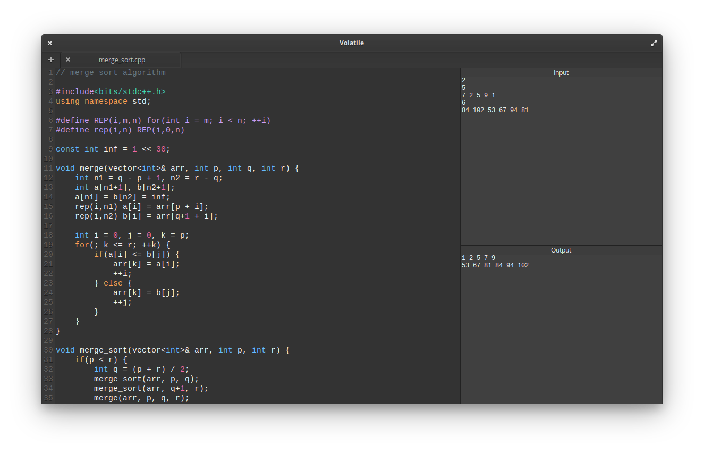
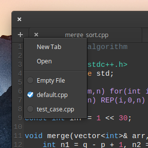
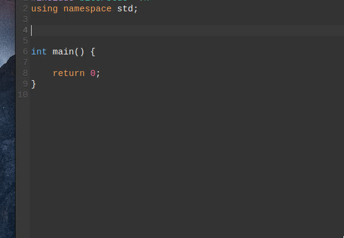
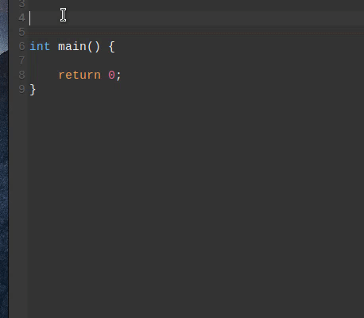
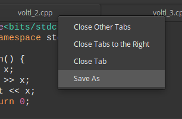

# 
~ Let's test some code...



When it comes to learning data structures and algorithms there is a ton of resources available in C++. Writing C++ code by yourself and testing it decreases your appetite if no scripts or tools are involved. Typing inputs into the terminal and switching / rearranging windows gets repulsive on the long run.

So, this tool I've build tackles some, if not all those hassles. It won't make you a good programmer / DSA expert but it'll make your learning period a lot less harsh, especially if you are a beginner like me.

Volatile is a name that describes this tool aptly. Open a tab, test some code, close it and get on with your life. Don't do long projects that take days in this tool because it wasn't built for that (obviously why would you...?). But if it fits your need, who am I to ask?

Let's get on with the features...

## Features
- ### Compile and Run
    Press `[F5]` and the code will be compiled. If you have any errors in the code, it'll be displayed in the output box. Otherwise the program is run and the output for the given input in the input box will be displayed in the output box.

- ### Templates
    Do you use particular `#define`(s), `typedef`(s) or some routines everytime? Then put them in a file and store it away in `~/Documents/Volatile/Templates/`. Now within this tool, right click on the + button in the tab bar. Select your template and it'll be loaded whenever you open a new tab (If your template isn't listed, you probably need to restart the tool). Do you have different templates for different use cases? Again, right click on the + button in the tab bar, select the other template you want to use just before opening a new tab.

    

- ### Snippets
    Do you have a piece of code that you use frequently but not everytime? Like fast exponential or a homegrown sorting algorithm. Save it in a file and store it away in `~/Documents/Volatile/Snippets/`. Within the editor type the name of the file and press `[Ctrl + I]` or right click on the word and select insert snippet.  
    eg. `~/Documents/Volatile/Snippets/fast_exp.cpp`. Within the editor type `fast_exp.cpp` and press `[Ctrl + I]`.  

    

    Basically you need to specify the path of the file from `~/Documents/Volatile/Snippets/`. So, you can have a directory of sorting algorithms like `~/Documents/Volatile/Snippets/sorting/merge_sort.cpp`. In this case type `sorting/merge_sort.cpp` and press `[Ctrl + I]`.

    

- ### Auto save
    Continue from where you left. Your tabs & inputs will be automatically saved when you close the tool and reimported when you reopen the tool.

    Think of this tool as a scribble pad that you carry around. You scribble something, see how it works and later tear the sheet out and trash it. But if you want to save it, you can right click on the tab you want to save and choose save as or press `[Ctrl + Shift + S]`.

    

- ### Misc
    There are a few keyboard shortcuts that I'll write here.

    - `[F1]` - Jump to editor.
    - `[F2]` - Jump to input box.
    - `[Ctrl + T]` - New Tab.
    - `[Ctrl + W]` - Close Tab.
    - `[Ctrl + Q]` - Quit.
    - `[Alt + num]` - Jump to num-th Tab.
    - `[Ctrl + /]` - Toggle comments.
    - `[Ctrl + UP]` - Move selection or line up.
    - `[Ctrl + DOWN]` - Move selection or line down.
    - `[Ctrl + O]` - Open a file. 

## Installing from source
Dependencies:
- `gee-0.8`
- `gtk+-3.0`
- `granite`
- `gtksourceview-3.0`
- `g++`
- `meson`

```
meson build --prefix=/usr
ninja
ninja install
```

## Credits
Two features - brackets completion (by Mario Guerriero) and comment toggling (by David Hewitt) - was taken from the elementary Code text editor. I thank both of them.

## Author
Navaneeth P

### PS :
This was something I made for myself with the free time I had and the small amount of Vala I was able to learn. It's in no way perfect.  
All contributions and requests are happily welcomed.
